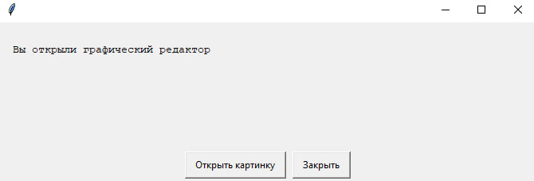
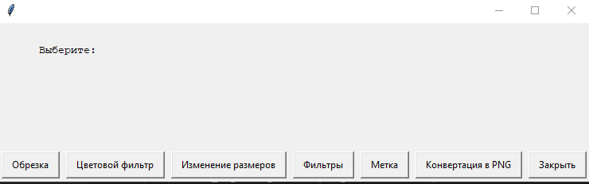
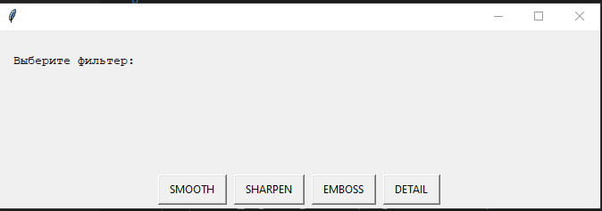
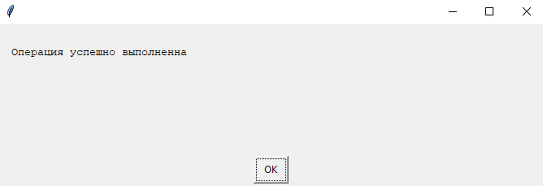

# Image Editor Using EasyGUI and Pillow
### Online school Kodland (winter 2021) 

This project is an image editor developed using the `easygui` and `Pillow` libraries. The editor provides a set of features for image processing, such as cropping, resizing, applying filters, and converting to PNG format.

## Features

- **Crop**: Crops the image based on specified coordinates.
- **Color filter**: Applies a black-and-white filter or negative effect to the image.
- **Resize**: Changes the image dimensions to the specified width and height.
- **Filters**: Applies enhancement filters to the image (SMOOTH, SHARPEN, EMBOSS, DETAIL).
- **Mark**: Adds a green mark to the image.
- **Convert to PNG**: Converts the image to PNG format.

## Installation and running

1. **Clone the repository:**
    ```bash
    git clone https://github.com/account_name/name_repository.git
    ```

2. **Navigate to the project directory:**
    ```bash
    cd name_repository
    ```

3. **Ensure required modules are installed:**
    Install the necessary modules using pip:
    ```bash
    pip install easygui pillow
    ```

4. **Run the script:**
    Open your command line or terminal and execute:
    ```bash
    python file_name.py
    ```

## Usage

1. After starting the script, a dialog will appear for you to open an image. Choose the image you want to edit.

2. In the next dialog, select one of the available options:
    - **Crop**: Enter the crop coordinates (x1, y1, x2, y2).
    - **Color filter**: Choose between a black-and-white filter or negative effect.
    - **Resize**: Specify the new width and height for the image.
    - **Filters**: Select one of the enhancement filters (SMOOTH, SHARPEN, EMBOSS, DETAIL).
    - **Mark**: Enter the size of the mark to add to the image.
    - **Convert to PNG**: Convert the image to PNG format.

3. After performing the selected operation, the result will be saved in the corresponding format and displayed in a new window.

4. You can close the application by selecting the "Close" option.

## Screenshots

### Filter Example






## Notes

- Ensure that the image you open is accessible and not corrupted.
- The program requires the `Pillow` module for image processing and `easygui` for the user interface.
